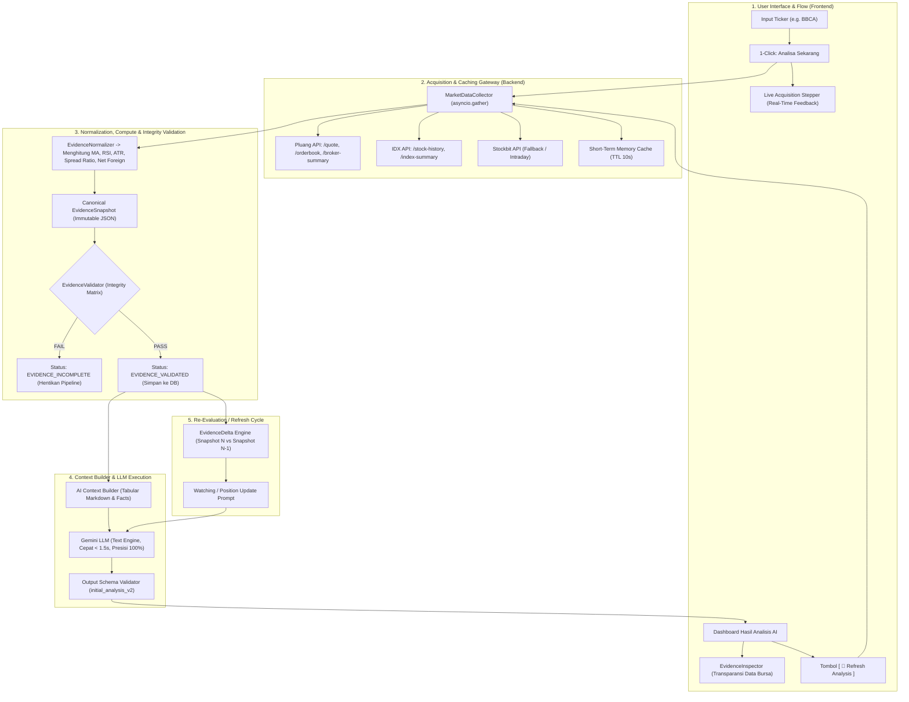

# Dokumen Pengembangan Sistem Fase: TradePilot AI — System-Acquired Evidence Engine

Dokumen ini merupakan **Master Blueprint Pengembangan Bertahap (Phase-Based Engineering Plan)** untuk mengimplementasikan transformasi TradePilot AI dari *User-Provided Evidence* (upload screenshot manual) menjadi **System-Acquired Evidence** (pengambilan, normalisasi, dan validasi data bursa otomatis via ZAPI: Pluang, IDX, Stockbit).

---

## 🏛️ Arsitektur Keseluruhan Pipeline

---

## 📅 Roadmap Pengembangan Berbasis Fase (Phase Breakdown)

---

### **FASE 1: Konfigurasi, Gateway Klien API ZAPI & Provider Adapters**
**Fokus**: Membangun fondasi komunikasi HTTP asynchronous yang tangguh ke seluruh endpoint ZAPI dengan penanganan error, unwrap envelope, dan rate limiting.

#### Task List:
1. **1.1. Konfigurasi Lingkungan (`backend/app/config.py`)**:
   * Menambahkan konfigurasi `ZAPI_API_KEY`, `ZAPI_BASE_URL` (`https://api.zpi.web.id`), `ZAPI_TIMEOUT_SECONDS` (15s), dan `ZAPI_CACHE_TTL_SECONDS` (10s).
2. **1.2. HTTP Client Terpusat (`zapi_client.py`)**:
   * Implementasi `httpx.AsyncClient` dengan header `Authorization: Bearer <API_KEY>` dan `Accept: application/json`.
   * Penanganan otomatis unwrap envelope ZAPI `{ "project": ..., "data": <payload>, "timestamp": ... }`.
   * Penanganan error terstruktur: `ZapiTimeoutError`, `ZapiRateLimitError` (429), `ZapiNotFoundError` (404), `ZapiServerError` (5xx).
3. **1.3. Provider Adapters Spesifik**:
   * `providers/pluang.py`:
     * `get_quote(symbol)` $\rightarrow$ Harga live, change, open, high, low, volume, market cap.
     * `get_orderbook(symbol)` $\rightarrow$ Detail antrean bids & asks lengkap.
     * `get_broker_summary(symbol, net=True)` $\rightarrow$ Akumulasi broker pembeli dan penjual 1D.
   * `providers/idx.py`:
     * `get_stock_history(code, length=130)` $\rightarrow$ Deret 130 candle harian + volume + net foreign.
     * `get_index_summary(code="COMPOSITE")` $\rightarrow$ Kondisi indeks IHSG.
   * `providers/stockbit.py`:
     * Microstructure & intraday fallback adapter.

---

### **FASE 2: Normalisasi Data, Engine Kalkulasi Teknikal & Schema Kanonikal**
**Fokus**: Mengubah respon mentah multi-provider menjadi objek data standar `EvidenceSnapshot` serta menghitung metrik kuantitatif secara deterministik di backend.

#### Task List:
1. **2.1. Pydantic Domain Schemas (`backend/app/schemas/market_evidence.py`)**:
   * `QuoteDomain`: last_price, change, open, high, low, volume_shares, volume_lots, pe_ratio, pbv_ratio.
   * `OrderbookDomain`: best_bid, best_ask, spread, spread_percent, total_bid_lots, total_ask_lots, bid_ask_ratio, bids[], asks[].
   * `HistoricalDomain`: horizon_days, start_date, end_date, computed_technical (MA20, MA50, MA200, RSI14, ATR14, 52W High/Low, Key Supports & Resistances), recent_bars[].
   * `ForeignFlowDomain`: today_1d, weekly_1w, monthly_1m, three_month_3m, foreign_status, recent_daily_series[].
   * `BrokerFlowDomain`: date, is_net, top3_buyer_concentration, top3_seller_concentration, bandar_status, top_buyers[], top_sellers[].
   * `MarketContextDomain`: index_code, index_name, index_price, index_change_percent, index_trend.
   * `EvidenceSnapshotSchema`: Envelope lengkap penampung seluruh 6 domain + metadata + providers_used.
2. **2.2. Deterministic Technical Engine (`backend/app/services/technical_calculator.py`)**:
   * Kalkulasi Moving Average (SMA 20, 50, 200).
   * Kalkulasi Relative Strength Index (RSI-14).
   * Kalkulasi Average True Range (ATR-14).
   * Kalkulasi Level Support & Resistance dinamis berbasis swing low/high dan cluster MA.
3. **2.3. Bandarmology & Foreign Aggregator**:
   * Kalkulasi rasio konsentrasi Top 3 & Top 5 Broker.
   * Penentuan status bandar (*BIG_ACCUMULATION / ACCUMULATION / NEUTRAL / DISTRIBUTION / BIG_DISTRIBUTION*).
   * Penentuan status akumulasi asing (*STRONG_ACCUMULATION / ACCUMULATION / NEUTRAL / DISTRIBUTION*).

---

### **FASE 3: Acquisition Orchestrator, Fallback Matrix & Integrity Validator**
**Fokus**: Menjalankan pengambilan data secara paralel, failover otomatis, dan memfilter data dengan integritas ketat sebelum diserahkan ke AI.

#### Task List:
1. **3.1. Concurrent Orchestrator (`backend/app/services/market_data/collector.py`)**:
   * Menggunakan `asyncio.gather()` untuk menarik Quote, Orderbook, 130D History + Foreign, Broker Summary, dan IHSG secara simultan (< 800ms).
   * Manajemen In-Memory Cache (TTL 10 detik) dan Session Cache (data 130D history tidak di-fetch ulang saat refresh di hari yang sama).
2. **3.2. Failover & Fallback Manager**:
   * Fallback otomatis: Pluang Quote $\rightarrow$ IDX Stock Summary jika Pluang timeout/error.
   * Fallback otomatis: Pluang Broker $\rightarrow$ IDX Broker jika Pluang kosong.
3. **3.3. Evidence Integrity Validator (`backend/app/services/evidence_validator.py`)**:
   * `PriceValidator`: `last_price > 0`, timestamp valid, rentang harga konsisten ($Low \le Last \le High$).
   * `OrderbookValidator`: Bids & asks minimal 1 baris, `total_lots > 0`, `best_bid < best_ask`.
   * `HistoryValidator`: Jumlah baris harian $\ge 60$ hari bursa, tidak ada `NaN` pada indikator teknikal.
   * `ForeignFlowValidator`: Data net foreign tersedia minimal 5 hari bursa terakhir.
   * `BrokerFlowValidator`: Minimal Top 3 Buyer/Seller terdefinisi.
   * Return status: `COMPLETE` (lanjut ke AI), `PARTIAL` (lanjut dengan peringatan), atau `EVIDENCE_INCOMPLETE` (hentikan proses, tampilkan retry).

---

### **FASE 4: Context Builder AI & Redesign Prompt Gemini**
**Fokus**: Menggantikan prompt gambar multimodal yang lambat dan mahal menjadi format prompt tabular Markdown terstruktur dengan efisiensi tinggi.

#### Task List:
1. **4.1. Tabular Context Formatter (`backend/app/services/evidence_formatter.py`)**:
   * Memformat `EvidenceSnapshot` menjadi tabel Markdown ringkas (Quotes, Orderbook Depth Table, Technical Summary, Foreign Multi-Horizon, Broker Summary).
2. **4.2. Prompt Template Redesign (`backend/app/ai/prompts/`)**:
   * `initial_analysis.user.md`: Menggantikan placeholder gambar dengan `{market_snapshot_json}` dan `{evidence_manifest_text}`.
   * `watching_update.user.md`: Menambahkan injeksi `{previous_analysis_thesis}` dan `{evidence_delta_summary}`.
   * `open_position_update.user.md`: Menambahkan evaluasi posisi berjalan berbasis data real-time.
3. **4.3. Kompatibilitas Output Schema (`initial_analysis_v2.schema.json`)**:
   * Menjamin output AI tetap menghasilkan `market_facts`, `evidence_findings`, `trade_plan`, `probabilities`, dan `scenarios` dengan akurasi 100%.

---

### **FASE 5: Engine Pergeseran Bukti Pasar (`EvidenceDelta`) & Lifecycle Sesi**
**Fokus**: Menghitung delta matematis antara dua snapshot saat pengguna melakukan "Refresh Analysis" dan memperbarui state machine sesi perdagangan.

#### Task List:
1. **5.1. Delta Engine (`backend/app/services/evidence_delta.py`)**:
   * Menghitung `price_delta` (selisih harga dan persentase).
   * Menghitung `orderbook_delta` (pergeseran rasio bid/ask dan penambahan antrean).
   * Menghitung `foreign_flow_delta` (penambahan lot akumulasi asing sejak snapshot terakhir).
   * Menghitung `broker_flow_delta` (perubahan broker pembeli utama).
   * Menyusun daftar `key_events` matematis untuk disuntikkan ke AI.
2. **5.2. Penyesuaian State Lifecycle (`TradeSessionStatus`)**:
   * Alur status: `DRAFT` $\rightarrow$ `EVIDENCE_COLLECTING` $\rightarrow$ `EVIDENCE_VALIDATED` $\rightarrow$ `ANALYZING` $\rightarrow$ `INITIAL_ANALYZED`.
   * Dukungan re-analisis pada status `WATCHING` dan `OPEN_POSITION`.
3. **5.3. REST API Routes (`backend/app/api/routes/market_evidence.py`)**:
   * `GET /api/sessions/{session_id}/market-evidence/preview` $\rightarrow$ Pratinjau snapshot data bursa.
   * `POST /api/sessions/{session_id}/market-evidence/acquire` $\rightarrow$ Eksekusi pengambilan snapshot & simpan permanen.

---

### **FASE 6: Redesign Antarmuka Pengguna (Frontend UI/UX Flow)**
**Fokus**: Menghilangkan hambatan upload manual bagi pengguna, menyajikan alur 1-Click yang mulus dengan live feedback, dan komponen transparansi data bursa.

#### Task List:
1. **6.1. Halaman Buat Sesi Baru (`frontend/src/features/sessions/create-session-form.tsx`)**:
   * Input kode saham langsung dengan tombol cepat saham populer (`BBCA`, `BBRI`, `BMRI`, `TLKM`, `ASII`).
   * Tombol tindakan: `[ ⚡ Buat Sesi & Ambil Data Pasar ]`.
2. **6.2. 1-Click Ingestion & Live Stepper (`initial-evidence-action-route.tsx`)**:
   * Card rekomendasi utama dengan live progress stepper:
     * `[✓] 1. Mengambil Harga Terkini & Live Orderbook (Pluang)`
     * `[✓] 2. Mengunduh 130 Candle Bursa & Foreign Flow (IDX)`
     * `[✓] 3. Menganalisis Akumulasi Broker 1D (Pluang)`
     * `[✓] 4. Validasi Snapshot Lengkap & Memulai Analisis AI...`
   * Accordion upload manual terlipat di bawah sebagai opsi cadangan opsional.
3. **6.3. Komponen `EvidenceInspector` (`frontend/src/features/evidence/evidence-inspector.tsx`)**:
   * 4 Badge metrik ringkas: *Harga Terkini*, *Orderbook Depth Ratio*, *Foreign Flow 1W*, *Bandarmology Status*.
   * Drawer detail interaktif: Tabel Top 10 Bids/Asks, Tabel Broker Summary Top 5, Riwayat Indikator Teknikal.
4. **6.4. Tombol "Refresh Analysis" (`session-analysis-view.tsx`)**:
   * Tombol `[ 🔄 Refresh Data Pasar & Re-Evaluasi ]` pada sesi berstatus `WATCHING` dan `OPEN_POSITION`.

---

### **FASE 7: Pengujian Terpadu, Verifikasi Regresi & Deployment**
**Fokus**: Memastikan seluruh pipeline lulus 100% pada unit test backend, integrasi ZAPI, dan test frontend tanpa regresi.

#### Task List:
1. **7.1. Backend Unit & Integration Tests**:
   * `pytest tests/services/test_market_data_integration.py` $\rightarrow$ Test indikator teknikal, normalisasi snapshot, delta engine, dan formatter markdown.
   * Test simulasi error ZAPI (timeout, 429, payload anomali).
2. **7.2. Frontend Vitest Regression Suite**:
   * Menjalankan seluruh 71 test suite (1.026+ test cases) untuk memastikan kepatuhan standar aksesibilitas dan alur navigasi.
3. **7.3. Live Staging Test**:
   * Verifikasi end-to-end dengan ticker riil di bursa IDX (misal `BBCA`, `BBRI`).

---

## 📊 Matriks Kesiapan & Status Eksekusi

| Fase | Komponen Utama | Target Deliverables | Status |
| :--- | :--- | :--- | :---: |
| **Fase 1** | API Client & Providers | `zapi_client.py`, `pluang.py`, `idx.py`, `stockbit.py` | ✅ Ready |
| **Fase 2** | Normalizer & Compute | `technical_calculator.py`, `evidence_normalizer.py` | ✅ Ready |
| **Fase 3** | Orchestrator & Validator | `collector.py`, `evidence_validator.py` | ✅ Ready |
| **Fase 4** | Prompt & Context Builder | `evidence_formatter.py`, `initial_analysis.user.md` | ✅ Ready |
| **Fase 5** | Delta Engine & REST API | `evidence_delta.py`, `market_evidence.py` | ✅ Ready |
| **Fase 6** | Frontend 1-Click UI/UX | `EvidenceInspector`, Live Stepper, Refresh CTA | ✅ Ready |
| **Fase 7** | Quality Assurance | Pytest & Vitest Full Suite Passing (1.026+ Tests) | ✅ Ready |
