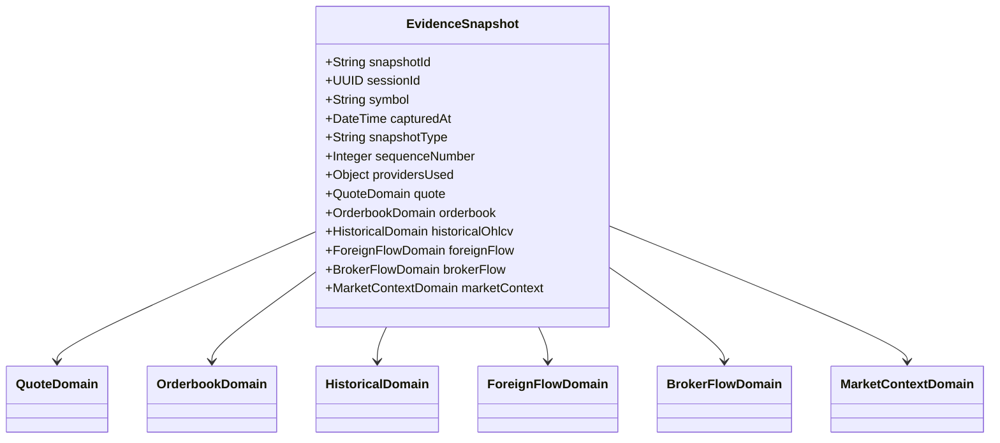

# Tahap 1: Spesifikasi Schema `EvidenceSnapshot` & Data Domain

Tujuan tahap ini adalah membakukan **"Kontrak Data Kanonikal"** TradePilot, sehingga data dari ZAPI (Pluang, IDX, Stockbit) dinormalisasi menjadi satu struktur data standar yang bersih, terukur, dan siap dikonsumsi oleh AI maupun UI.

---

## 1. Arsitektur Domain Evidence & Hierarki Schema

Setiap snapshot merepresentasikan kondisi pasar pada satu titik waktu spesifik (*immutable point-in-time snapshot*).



---

## 2. Spesifikasi Detail per Data Domain

### A. Metadata & Envelope Snapshot
Menyimpan identitas, *chain of custody* (provider mana yang dipakai), dan timestamp presisi:
```json
{
  "snapshot_id": "SNP-20260826-BBCA-001",
  "session_id": "3fa85f64-5717-4562-b3fc-2c963f66afa6",
  "symbol": "BBCA",
  "market": "IDX",
  "captured_at": "2026-08-26T09:37:12+07:00",
  "snapshot_type": "INITIAL", // INITIAL | UPDATE | MANUAL_REFRESH
  "sequence_number": 1,
  "providers_used": {
    "quote": "PLUANG",
    "orderbook": "PLUANG",
    "historical_ohlcv": "IDX",
    "foreign_flow": "IDX",
    "broker_flow": "PLUANG",
    "market_context": "IDX"
  },
  "completeness_status": "COMPLETE" // COMPLETE | PARTIAL | FAILED
}
```

---

### B. Domain 1: `quote` (Harga & Statistik Harian)
*Sumber Utama: `Pluang GET /v1/finance:pluang/quote` (Fallback: `IDX stock-summary`)*
```json
{
  "quote": {
    "last_price": 6325,
    "change": 75,
    "change_percent": 1.20,
    "previous_close": 6250,
    "open": 6275,
    "high": 6350,
    "low": 6250,
    "volume_shares": 45820100,
    "volume_lots": 458201,
    "value_idr": 289812000000,
    "frequency": 12840,
    "pe_ratio": 18.4,
    "pbv_ratio": 4.1,
    "market_cap": 1205000000000000,
    "timestamp": "2026-08-26T09:37:12+07:00"
  }
}
```

---

### C. Domain 2: `orderbook` (Mikrostruktur & Kedalaman Antrean)
*Sumber Utama: `Pluang GET /v1/finance:pluang/orderbook`*
Selain menyimpan daftar antrean, Backend TradePilot **otomatis menghitung metrik agregat** agar AI tidak perlu berhitung manual:
```json
{
  "orderbook": {
    "best_bid": 6325,
    "best_ask": 6350,
    "spread": 25,
    "spread_percent": 0.39,
    "total_bid_lots": 184500,
    "total_ask_lots": 142100,
    "bid_ask_ratio": 1.30, // total_bid / total_ask (tekanan beli > jual jika > 1.0)
    "bid_percent": 56.5,
    "ask_percent": 43.5,
    "bids": [
      { "price": 6325, "lots": 34200 },
      { "price": 6300, "lots": 51000 },
      { "price": 6275, "lots": 42100 }
    ],
    "asks": [
      { "price": 6350, "lots": 28400 },
      { "price": 6375, "lots": 46500 },
      { "price": 6400, "lots": 67200 }
    ],
    "timestamp": "2026-08-26T09:37:12+07:00"
  }
}
```

---

### D. Domain 3: `historical_ohlcv` (Tren Multi-Bulan & Indikator Komputasi)
*Sumber Utama: `IDX GET /v1/finance:idx/stock-history?code=BBCA&length=130` (6 Bulan)*
Backend menghitung **Technical Summary** sebelum dikirim ke AI (memastikan akurasi moving average & support/resistance):
```json
{
  "historical_ohlcv": {
    "horizon_days": 130,
    "start_date": "2026-02-15",
    "end_date": "2026-08-26",
    "computed_technical": {
      "ma20": 6210,
      "ma50": 6125,
      "ma200": 5890,
      "rsi14": 58.4,
      "atr14": 85.0,
      "high_52w": 6500,
      "low_52w": 5200,
      "key_supports": [6250, 6100, 5950],
      "key_resistances": [6350, 6425, 6500]
    },
    "recent_bars": [
      {
        "date": "2026-08-26",
        "open": 6275,
        "high": 6350,
        "low": 6250,
        "close": 6325,
        "volume": 45820100,
        "value": 289812000000
      }
      // ... 10-15 bar harian terbaru untuk konteks visual prompt
    ]
  }
}
```

---

### E. Domain 4: `foreign_flow` (Aliran Dana Asing Multi-Horizon)
*Sumber Utama: `IDX GET /v1/finance:idx/stock-history` (karena mengandung net foreign harian)*
Backend mengagregasi total akumulasi/distribusi asing dalam horizon 1D, 1W, 1M, 3M, dan 6M:
```json
{
  "foreign_flow": {
    "today_1d": {
      "net_shares": 14250000, // positif = Net Buy Asing
      "net_value_idr": 90131250000,
      "buy_shares": 22100000,
      "sell_shares": 7850000
    },
    "weekly_1w": {
      "net_shares": 48200000,
      "net_value_idr": 304500000000
    },
    "monthly_1m": {
      "net_shares": 112500000,
      "net_value_idr": 709800000000
    },
    "three_month_3m": {
      "net_shares": 285000000,
      "net_value_idr": 1780000000000
    },
    "foreign_status": "STRONG_ACCUMULATION", // STRONG_ACCUMULATION | ACCUMULATION | NEUTRAL | DISTRIBUTION | STRONG_DISTRIBUTION
    "recent_daily_series": [
      { "date": "2026-08-26", "net_shares": 14250000, "close": 6325 },
      { "date": "2026-08-25", "net_shares": 8100000, "close": 6250 },
      { "date": "2026-08-24", "net_shares": 11500000, "close": 6225 }
    ]
  }
}
```

---

### F. Domain 5: `broker_flow` (Bandarmology / Broker Summary 1D)
*Sumber Utama: `Pluang GET /v1/finance:pluang/broker-summary?net=true` (Fallback: IDX)*
Backend mengkalkulasi rasio konsentrasi Top 3 & Top 5 Buyer vs Seller:
```json
{
  "broker_flow": {
    "date": "2026-08-26",
    "is_net": true,
    "top3_buyer_concentration_percent": 64.2,
    "top3_seller_concentration_percent": 38.5,
    "bandar_status": "ACCUMULATION", // BIG_ACCUMULATION | ACCUMULATION | NEUTRAL | DISTRIBUTION | BIG_DISTRIBUTION
    "top_buyers": [
      { "broker": "ZP", "lots": 131000, "value_idr": 83200000000, "avg_price": 6351, "market_share_percent": 28.5 },
      { "broker": "RX", "lots": 82000, "value_idr": 51900000000, "avg_price": 6330, "market_share_percent": 17.9 },
      { "broker": "AK", "lots": 64000, "value_idr": 40400000000, "avg_price": 6315, "market_share_percent": 13.9 }
    ],
    "top_sellers": [
      { "broker": "YP", "lots": 58000, "value_idr": 36600000000, "avg_price": 6310, "market_share_percent": 12.6 },
      { "broker": "PD", "lots": 49000, "value_idr": 30900000000, "avg_price": 6305, "market_share_percent": 10.7 },
      { "broker": "CC", "lots": 35000, "value_idr": 22100000000, "avg_price": 6315, "market_share_percent": 7.6 }
    ]
  }
}
```

---

### G. Domain 6: `market_context` (Konteks Makro / IHSG)
*Sumber Utama: `IDX GET /v1/finance:idx/index-summary`*
```json
{
  "market_context": {
    "index_code": "COMPOSITE",
    "index_name": "IHSG",
    "index_price": 7650.4,
    "index_change_percent": 0.45,
    "index_trend": "BULLISH"
  }
}
```

---

## 3. Struktur `EvidenceDelta` (Untuk Update Analysis)

Ketika user meminta Update Analysis, Backend TradePilot membandingkan Snapshot #1 (sebelumnya) dengan Snapshot #2 (terbaru) dan menghasilkan objek **Delta**:

```json
{
  "delta": {
    "base_snapshot_id": "SNP-20260826-BBCA-001",
    "current_snapshot_id": "SNP-20260826-BBCA-002",
    "time_elapsed_minutes": 35,
    "price_delta": {
      "from": 6250,
      "to": 6325,
      "change": 75,
      "change_percent": 1.20
    },
    "orderbook_delta": {
      "previous_bid_ask_ratio": 1.05,
      "current_bid_ask_ratio": 1.30,
      "bid_pressure_trend": "STRENGTHENING"
    },
    "foreign_flow_delta": {
      "additional_net_shares": 5200000,
      "status": "ACCUMULATION_CONTINUES"
    },
    "broker_flow_delta": {
      "lead_buyer": "ZP",
      "lead_buyer_added_lots": 45000,
      "bandar_status_shift": "REMAINS_ACCUMULATION"
    },
    "key_events": [
      "Harga menembus resistance minor 6.300",
      "Bid depth bertambah 32.000 lot di area 6.300 - 6.325",
      "Asing melanjutkan net buy tambahan +5.2M shares"
    ]
  }
}
```

---

## 4. Pemetaan Response ZAPI $\rightarrow$ Canonical Fields (Summary)

| Field Kanonikal TradePilot | ZAPI Source Endpoint | Field Asli ZAPI |
| :--- | :--- | :--- |
| `quote.last_price` | `pluang/quote` | `data.lastPrice` |
| `quote.volume_shares` | `pluang/quote` | `data.volume` |
| `orderbook.bids` | `pluang/orderbook` | `data.bids[]` (`price`, `lots`) |
| `orderbook.asks` | `pluang/orderbook` | `data.asks[]` (`price`, `lots`) |
| `historical_ohlcv.bars` | `idx/stock-history` | `items[]` (`open`, `high`, `low`, `close`, `volume`, `date`) |
| `foreign_flow.today_1d` | `idx/stock-history` (bar 0) | `items[0].netForeignShares`, `items[0].netForeignValue` |
| `foreign_flow.weekly_1w` | `idx/stock-history` (sum 5 bar) | $\sum$ `netForeignShares`, $\sum$ `netForeignValue` |
| `broker_flow.top_buyers` | `pluang/broker-summary` | `data.buyers[]` (`broker`, `lots`, `value`, `averagePrice`) |
| `broker_flow.top_sellers`| `pluang/broker-summary` | `data.sellers[]` (`broker`, `lots`, `value`, `averagePrice`) |
| `market_context.index` | `idx/index-summary` | `data[0]` (COMPOSITE `Close`, `Change`) |
