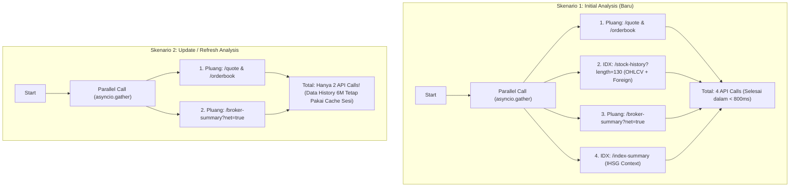
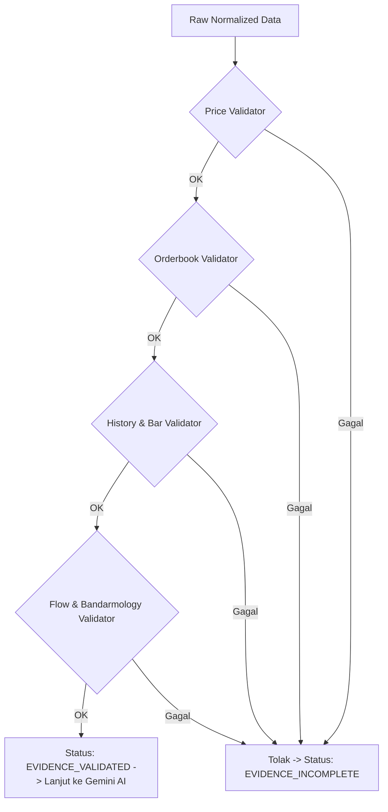

# Tahap 2: Acquisition Policy, Fallback Matrix & Evidence Validator Rules

Tujuan tahap ini adalah mengunci **aturan main sistem backend**: bagaimana data dikumpulkan secara efisien, bagaimana mekanisme fallback jika satu provider down, dan kriteria ketat apa yang menentukan apakah data layak dianalisis oleh AI atau harus berstatus `EVIDENCE_INCOMPLETE`.

---

## 1. Acquisition Policy & ZAPI Request Budget

Kita membagi pengambilan data menjadi 2 skenario dengan alokasi request yang sangat hemat:

### Kebijakan Caching & Rate-Limit Guard:
* **Short-Term In-Memory Cache (TTL: 10 detik)**: Jika user menekan tombol refresh berulang kali dalam 10 detik, sistem menyajikan data dari memory lokal tanpa memotong kuota ZAPI.
* **Session Cache untuk Data Historis**: Pada Update Analysis, data deret harga 6 bulan (`stock-history`) **tidak perlu dipanggil ulang** karena candle harian tidak berubah di tengah hari yang sama. Kita hanya mengambil microstructure & flow hari ini.

---

## 2. Provider Priority & Fallback Matrix

Jika provider utama lambat (timeout > 3 detik), mengalami *rate-limit (429)*, atau error *5xx*, sistem otomatis beralih ke provider cadangan (*failover*) secara transparan:

| Evidence Domain | Prioritas 1 (Primary) | Prioritas 2 (Fallback) | Strategi Failover |
| :--- | :--- | :--- | :--- |
| **Current Price & Stats** | `Pluang /quote` | `IDX /stock-summary` | Ambil quote Pluang; jika gagal ambil dari ringkasan saham IDX. |
| **Order Book** | `Pluang /orderbook` | `Stockbit /symbol` | Pluang menyajikan detail bid/ask terlengkap. |
| **Historical OHLCV (6M)** | `IDX /stock-history` | `Pluang /chart` (daily) | IDX paling otoritatif untuk data historis bursa hingga 2000 baris. |
| **Foreign Flow** | `IDX /stock-history` | `IDX /foreign-flow` | Mengambil kolom `netForeignShares` dari history harian IDX. |
| **Broker Flow (1D)** | `Pluang /broker-summary` | `IDX /broker-summary` | Pluang menyajikan `averagePrice` dan lot per broker dengan format bersih. |
| **Market Context (IHSG)** | `IDX /index-summary` | `Pluang /quote?code=COMPOSITE`| Mengambil indeks IHSG untuk barometer sentimen pasar. |

---

## 3. Evidence Validator Rules & Integrity Matrix

Prinsip utama TradePilot: **"Garbage In, Garbage Out Prevention"**. Gemini **TIDAK AKAN PERNAH** dipanggil jika salah satu validator wajib di bawah ini gagal.

### Rincian Aturan Validasi:

| Validator | Target Field | Aturan Validasi (Rule) | Penanganan Jika Gagal |
| :--- | :--- | :--- | :--- |
| **`PriceValidator`** | `quote.last_price`, `quote.open` | • `last_price > 0` • Timestamp tidak lebih usang dari 1 hari bursa terakhir. • Rentang harga masuk akal (Low $\le$ Last $\le$ High). | Lempar error: `INVALID_PRICE_DATA` |
| **`OrderbookValidator`** | `orderbook.bids`, `orderbook.asks` | • Array `bids` dan `asks` minimal berisi 1 baris (kecuali market pre-open/suspensi). • `total_bid_lots > 0` dan `total_ask_lots > 0`. • `best_bid < best_ask` (tidak boleh crossed, kecuali sesi pre-closing). | Tandai flag `ORDERBOOK_UNAVAILABLE` |
| **`HistoryValidator`** | `historical_ohlcv.bars` | • Jumlah baris harian $\ge$ 60 hari bursa (minimal 3 bulan). • Tidak ada celah (*gap*) anomali kalender bursa. • Kalkulasi teknikal (MA20, MA50, RSI14) berhasil dihitung tanpa `NaN` atau `null`. | Lempar error: `INSUFFICIENT_HISTORICAL_DATA` |
| **`ForeignFlowValidator`** | `foreign_flow.today_1d` | • Data `net_shares` tersedia. • Historis minimal 5 hari bursa terakhir tersedia untuk kalkulasi 1W Net Foreign. | Fallback ke `IDX foreign-flow` atau flag `FOREIGN_FLOW_PARTIAL` |
| **`BrokerFlowValidator`** | `broker_flow.top_buyers` | • Minimal ada Top 3 Buyer dan Top 3 Seller. • Total lot broker $\le$ total volume bursa pada hari tersebut. | Flag `BROKER_FLOW_UNAVAILABLE` |

---

## 4. Penanganan Kondisi Khusus Pasar (Market Edge Cases)

Bagaimana TradePilot bersikap dalam situasi pasar yang dinamis:

1. **Market Tutup / Weekend / Libur Bursa (`MARKET_CLOSED`)**:
   * *Status*: **VALID**.
   * *Perilaku*: Snapshot menggunakan data penutupan (*closing price*) hari bursa terakhir. AI diberi konteks *"Analisa dibuat berdasarkan data penutupan bursa YYYY-MM-DD"*.
2. **Sesi Pre-Opening / Pre-Closing (`AUCTION_PHASE`)**:
   * *Perilaku*: Orderbook mungkin tidak memiliki spread normal (harga teoritis). Validator menandai metadata `market_phase = "PRE_OPENING"`, sehingga AI tidak menganggap spread rapat sebagai anomali.
3. **Saham Disuspensi / Unusual Market Activity (`SUSPENDED`)**:
   * *Perilaku*: Sistem mengecek status suspensi dari IDX. Jika disuspensi, proses langsung berhenti dengan pesan: *"Saham ini sedang dalam status suspensi bursa. Analisa dihentikan."*
4. **Saham IPO Baru (< 3 Bulan)**:
   * *Perilaku*: Jika data history < 60 hari karena emiten baru IPO, validator memberikan status `EVIDENCE_PARTIAL_NEW_IPO`. AI diarahkan untuk menganalisa berdasarkan *Price Action Intraday + Bandarmology + Valuation* tanpa memaksakan indikator teknikal jangka panjang (MA200/52W High).

---

## 5. Hasil Akhir Status & Respon ke User Interface

| Hasil Validasi | Status Sesi Internal | Respon UI ke User | Aksi AI |
| :--- | :--- | :--- | :--- |
| **Semua Domain Lolos** | `EVIDENCE_VALIDATED` | Indikator checklist hijau semua $\rightarrow$ Masuk ke proses analisa. | **Dijalankan** |
| **Domain Sekunder Kurang (e.g. Broker Summary belum rilis)** | `EVIDENCE_PARTIAL` | Indikator kuning dengan badge peringatan: *"Data Broker Summary hari ini belum dirilis bursa. Analisa dilanjutkan tanpa bandarmology 1D."* | **Dijalankan dengan Disclaimer** |
| **Domain Primer Gagal (Harga / History 0)** | `EVIDENCE_INCOMPLETE` | Indikator merah: *"Gagal mengambil data harga terkini dari bursa. Silakan klik tombol 'Coba Lagi'."* | **Dibatalkan (Hemat Token)** |
