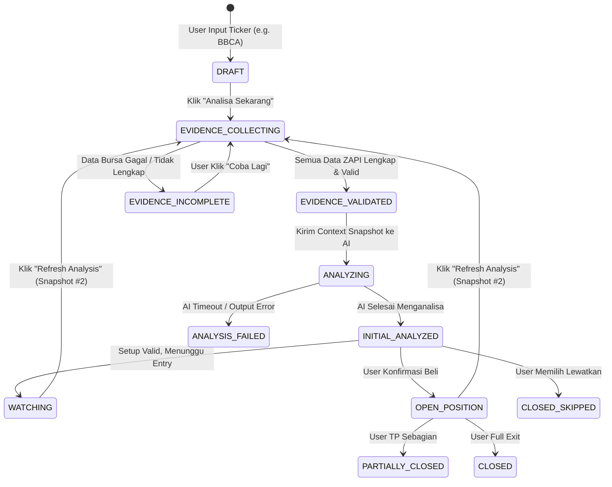

# Tahap 4: Penyesuaian State Lifecycle, UX Flow & Dokumen PRD

Tahap ini menyatukan semua fondasi teknis ke dalam alur kerja end-to-end: dari siklus hidup sesi di backend, antarmuka pengguna (UI/UX) yang bersih, hingga pembaruan dokumen PRD.

---

## 1. Modernisasi State Lifecycle Engine

Kita memperbarui alur status sesi (`TradeSessionStatus`) agar mencerminkan proses **System-Acquired Evidence**:



### Deskripsi Status Baru:
* **`DRAFT`**: Sesi dibuat dengan identitas ticker, timeframe, dan strategi.
* **`EVIDENCE_COLLECTING`**: Backend secara paralel menghubungi ZAPI (Pluang + IDX + Stockbit).
* **`EVIDENCE_VALIDATED`**: Data berhasil dinormalisasi dan divalidasi $\rightarrow$ Snapshot disimpan secara permanen di database.
* **`EVIDENCE_INCOMPLETE`**: Terjadi kendala data (misal ticker disuspensi atau API timeout). Menampilkan tombol *Retry* tanpa menghabiskan kuota AI.
* **`ANALYZING`**: Gemini memproses data tabular snapshot.
* **`INITIAL_ANALYZED`**: Hasil analisa, trade plan (Entry, SL, TP), dan probabilitas siap ditindaklanjuti user.

---

## 2. Redesign Antarmuka Pengguna (UI/UX Flow)

Kita mengganti total komponen upload screenshot lama (`evidence-upload-form.tsx`) dengan antarmuka yang modern, cepat, dan transparan:

### A. Halaman Buat Sesi Baru (`/sessions/new`)
Form sederhana 1-layar:
* **Input Ticker**: Input teks dengan *auto-uppercase* & pencarian emiten (misal: `BBCA` - Bank Central Asia Tbk.).
* **Trading Style**: Pilihan chip cepat (`Day Trade`, `Swing Trade`, `Scalping`).
* **Catatan Awal (Opsional)**: Catatan setup user (misal: *"Menunggu pantulan di MA50"*).
* **Tombol Utama**: **`[ ⚡ Ambil Data & Mulai Analisa ]`**

---

### B. Real-Time Acquisition Progress (Live Stepper)
Saat tombol ditekan, modal / progress card menampilkan checklist progres secara instan (< 1 detik):
```
⟳ Mengumpulkan Bukti Pasar BBCA...
  [✓] Harga Terkini & Live Orderbook (Pluang)
  [✓] Riwayat 130 Candle Bursa & Foreign Flow (IDX)
  [✓] Analisis Akumulasi Broker 1D (Pluang)
  [✓] Validasi snapshot lengkap (#SNP-20260826-BBCA-001)
⟳ Menganalisis setup dengan AI Gemini...
```

---

### C. Komponen Baru: `EvidenceInspector` (Pengganti Form Upload Lama)
Di halaman analisa sesi, user disajikan ringkasan bukti otomatis dengan tombol drawer untuk transparansi penuh:

```
┌─────────────────────────────────────────────────────────────────────────────┐
│ 📊 EVIDENCE SNAPSHOT #SNP-20260826-BBCA-001             Waktu: 09:37:12 WIB │
├───────────────┬─────────────────┬───────────────────┬───────────────────────┤
│ Harga Terkini │ Orderbook Ratio │ Foreign Flow (1W) │ Broker Flow (1D)      │
│ Rp 6.325      │ 1.30x (Bid Dom) │ +482.000 lot (Buy)│ Akumulasi (ZP, RX)    │
│ [Pluang • OK] │ [Pluang • OK]   │ [IDX • OK]        │ [Pluang • OK]         │
└───────────────┴─────────────────┴───────────────────┴───────────────────────┘
  [ 🔍 Buka Detail Bukti Pasar (Raw Orderbook & Broker Summary) ]
```

* Jika user mengklik *"Buka Detail Bukti Pasar"*, muncul drawer samping yang menampilkan:
  1. Tabel Live Depth Orderbook (Top 10 Bids vs Asks).
  2. Tabel Top 5 Broker Net Buyers vs Net Sellers.
  3. Grafik Tren Akumulasi Foreign Flow 1 bulan terakhir.
  4. Riwayat indikator teknikal (MA20/50/200, RSI, Support/Resistance).

---

### D. Fitur "Refresh Analysis" pada Sesi Aktif (`WATCHING` & `OPEN_POSITION`)
* Pada header sesi aktif, terdapat tombol **`[ 🔄 Refresh Market & Update Analisa ]`**.
* Sekali klik $\rightarrow$ sistem mengambil Snapshot baru $\rightarrow$ menghitung Evidence Delta $\rightarrow$ AI mengevaluasi apakah tesis masih bertahan atau berubah (*Decision Changed: WAIT $\rightarrow$ BUY*).

---

## 3. Pembaruan Dokumen PRD & Spesifikasi Repository

Kita akan memperbarui dokumen spesifikasi di `/docs`:
1. **`docs/evidence-expansion/TradePilot_AI_PRD_System_Acquired_Evidence.md`**:
   * Mendefinisikan filosofi baru: *System-Acquired Evidence*.
   * Menetapkan kontrak provider ZAPI (Pluang, IDX, Stockbit).
2. **`docs/rebuild/ANALYSIS_INPUT_CONTRACTS.md`**:
   * Memperbarui kontrak input context AI dari format multimodal gambar ke format tabular snapshot kanonikal.
3. **`docs/archive/SESSION_LIFECYCLE.md`**:
   * Memperbarui state machine sesi (`EVIDENCE_COLLECTING`, `EVIDENCE_VALIDATED`).

---

## 🏆 Ringkasan Hasil 4 Tahapan Perancangan

| Tahap | Topik | Status Hasil |
| :--- | :--- | :---: |
| **Tahap 1** | **Schema `EvidenceSnapshot` & Data Domain** | ✅ Schema JSON kanonikal (Quote, Orderbook, 6M OHLCV, Foreign Flow, Broker Flow, Delta) telah dibakukan. |
| **Tahap 2** | **Acquisition Policy & Validator Rules** | ✅ Alokasi hemat 3-4 request ZAPI, fallback matrix, dan aturan validasi ketat telah ditentukan. |
| **Tahap 3** | **Prompt Redesign & Context Builder** | ✅ Format prompt tabular teks siap pakai, hemat token 70%, bebas OCR miss, 100% kompatibel dengan schema output `initial_analysis_v2`. |
| **Tahap 4** | **Lifecycle, UX Flow & PRD Update** | ✅ State machine baru, 1-click UX flow, komponen `EvidenceInspector`, dan update dokumen PRD telah dirancang. |
